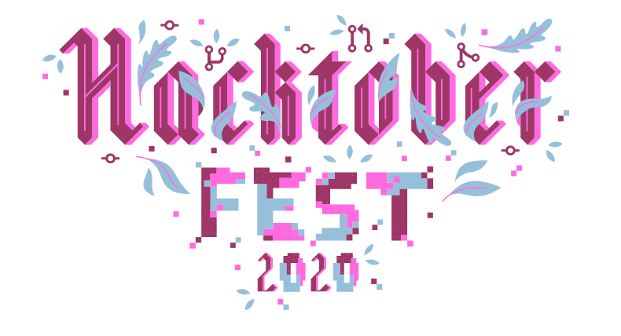

# HACKTOBERFEST 2020

### Hacktoberfest is a month-long virtual festival to celebrate open source software in partnership with Github. It is celebrated in the month of October every year. All you have to do is contribute to any open source projects and make at least 4 pull requests within the month of October.

### This is a beginner-friendly repo to help you in open-source contributions. Made specifically for HACKTOBERFEST 2020!

### Please check first if the project idea is already present in this repo, if it's already there then don't add that!

### How to create pull requests (PRs)?
  1. Sign up or sign in to your <a href="https://github.com/"> Github </a> account.
  2. Register yourself at <a href="https://hacktoberfest.digitalocean.com/"> Hactoberfest 2020 </a> using your Github account.
  3. Come back to this <a href="https://github.com/coderslane/project-ideas"> Hacktoberfest repo</a>.
  4. Click on Fork.
  5. Add your project idea.
  

` You need to make 4 pull requests to win an exclusive Hacktoberfest 2020 Tshirt and stickers! `

` Even if your pull requests aren’t accepted, it should count towards your 4 pull requests (that's necessary to win the swags).`

### Give it a Star if you liked it! ⭐
